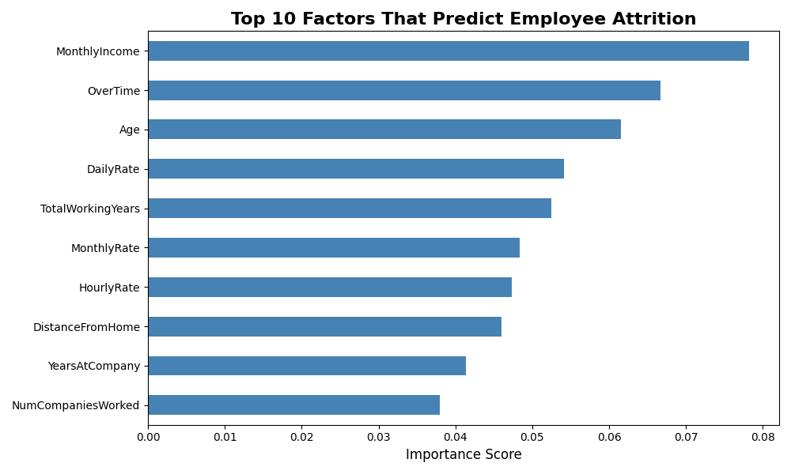
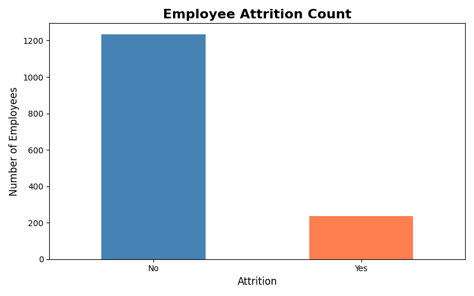
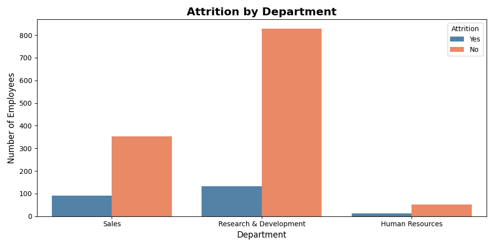
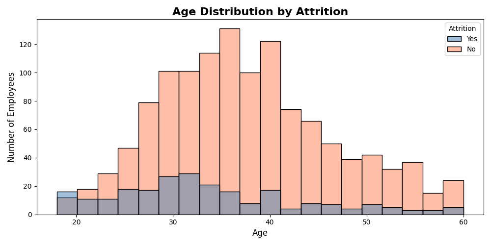
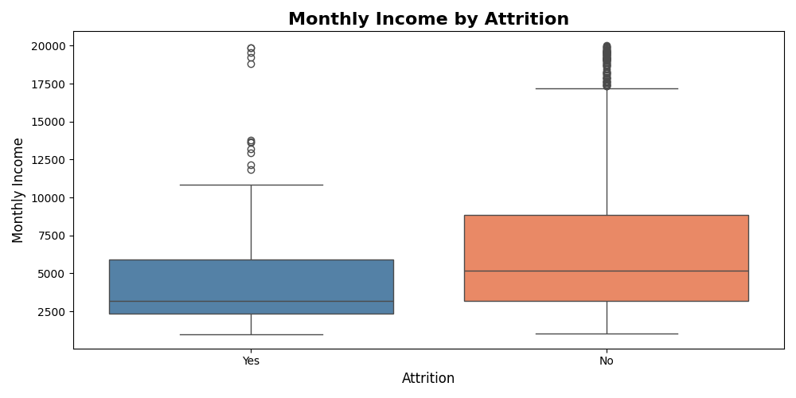
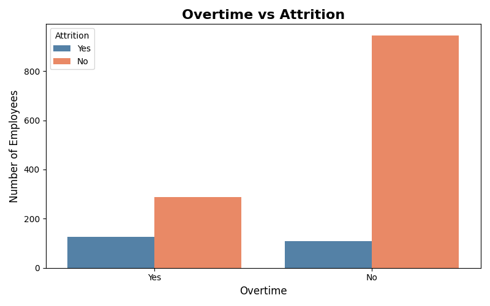
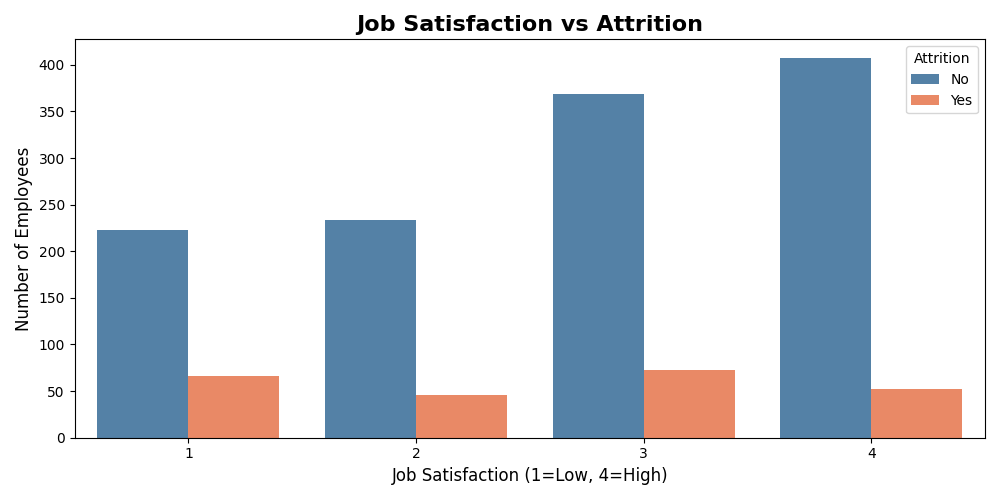
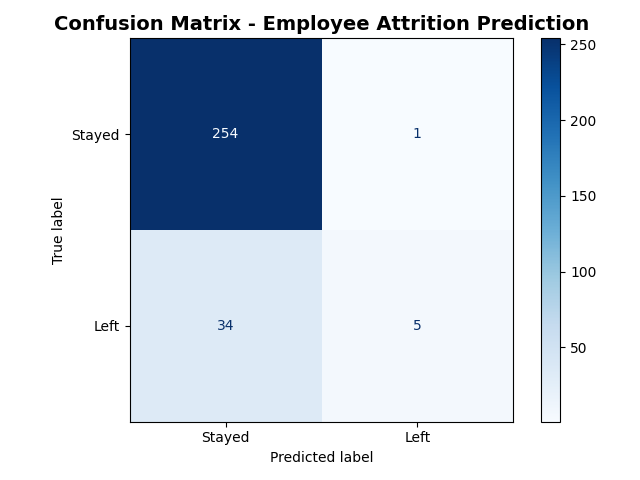

# HR Analytics - Employee Attrition Analysis

> Analyzing 1,470 IBM employee records to uncover why employees leave and predict future attrition using Machine Learning.



---

## Project Overview

Employee attrition is one of the most costly challenges faced by organizations worldwide. Losing a skilled employee costs a company anywhere between 50% to 200% of that employee's annual salary — including recruitment, training, and lost productivity costs.

In this project, I analyzed a real IBM HR dataset containing **1,470 employee records and 35 features** to answer one critical business question:

> *"What factors cause employees to leave, and can we predict who will leave next?"*

The project is divided into two parts:
- **Part 1 — Exploratory Data Analysis (EDA):** Understanding patterns and trends in employee attrition
- **Part 2 — Machine Learning:** Building a Random Forest model to predict employee attrition with 88.10% accuracy

---

## Dataset

| Column | Description |
|---|---|
| Age | Employee age |
| Attrition | Whether employee left (Yes/No) — Target Variable |
| Department | Department of employee |
| MonthlyIncome | Monthly salary |
| JobSatisfaction | Job satisfaction rating (1-4) |
| OverTime | Whether employee works overtime |
| YearsAtCompany | Total years at company |
| JobRole | Role of employee |
| MaritalStatus | Marital status |
| WorkLifeBalance | Work life balance rating (1-4) |

**Dataset shape: 1,470 rows x 35 columns**

---

## Key Findings

- Only **16.1% of employees left** — but that's 237 people which is costly for any organization
- **Employees doing overtime are 3x more likely to quit** — strongest single predictor
- **Low salary is the #1 ML-predicted cause** of attrition — employees who left earned median $3,000 vs $5,000 for those who stayed
- **Young employees aged 25-35** have the highest attrition rate
- **Sales department** has the highest attrition rate relative to its size
- Even **highly satisfied employees still leave** — meaning satisfaction alone doesn't retain talent

---

## Exploratory Data Analysis

### 1. Attrition Count


Out of 1,470 employees, 1,233 stayed (83.9%) and 237 left (16.1%). While the percentage seems small, replacing these employees carries significant financial and operational costs for the organization.

---

### 2. Attrition by Department


Research & Development has the highest absolute number of employees leaving (133), but Sales has the most alarming attrition rate relative to its size — nearly 1 in 4 Sales employees left. Human Resources has the lowest attrition overall.

---

### 3. Age Distribution by Attrition


Employees aged 25-35 show the highest attrition across all age groups. This is the most ambitious career-building phase of a professional's life — employees in this range are actively seeking better opportunities, higher salaries, and faster growth. After age 40, attrition drops significantly as employees tend to value stability more.

---

### 4. Monthly Income by Attrition


One of the clearest findings in the project. Employees who left had a median monthly income of around $3,000 compared to $5,000 for those who stayed. This $2,000 gap is a strong signal that salary dissatisfaction is a primary driver of attrition.

---

### 5. Overtime vs Attrition


Employees working overtime have a 31% attrition rate compared to just 10% for those who don't. This means overtime employees are three times more likely to quit. This is the single strongest behavioral predictor of attrition found in this analysis.

---

### 6. Job Satisfaction vs Attrition


Employees with the lowest job satisfaction (rating 1) have the highest attrition rate at around 23%. However, even employees with high satisfaction (rating 4) still leave at a notable rate. This confirms that job satisfaction alone is not enough to retain employees — salary and work-life balance matter more.

---

## Machine Learning Model

### Goal
Predict whether an employee will leave the company (yes/no) based on their profile and working conditions.

### Model Used
Random Forest Classifier — an ensemble model that builds multiple decision trees and combines their results for more accurate and stable predictions.

### Features Used
All 31 remaining columns after dropping EmployeeCount, EmployeeNumber, Over18, and StandardHours.

### Results

| Metric | Score |
|---|---|
| Accuracy | 88.10% |
| Training Split | 80% |
| Testing Split | 20% |

### Feature Importance


The model identified Monthly Income, Overtime, and Age as the top three predictors of employee attrition — consistent with what the EDA revealed. This cross-validation between statistical analysis and machine learning makes the findings more reliable and actionable.

### Confusion Matrix


| | Predicted: Stayed | Predicted: Left |
|---|---|---|
| Actual: Stayed | 254 | 1 |
| Actual: Left | 34 | 5 |

The model made only 35 mistakes out of 294 predictions on unseen test data.

---

## Recommendations for HR Departments

Based on this analysis, here are data-driven recommendations:

1. **Review salary structures** — Monthly income is the strongest predictor of attrition. A compensation audit focusing on junior and mid-level employees would have the highest retention impact.
2. **Regulate overtime policies** — Employees on overtime are 3x more likely to leave. Introducing overtime caps or compensation adjustments could significantly reduce attrition.
3. **Focus retention efforts on 25-35 age group** — This group has the highest attrition. Structured career development programs and growth opportunities would help retain them.
4. **Prioritize Sales department** — Nearly 1 in 4 Sales employees left. A targeted retention program for Sales is urgently needed.
5. **Do not rely on satisfaction surveys alone** — Even satisfied employees leave when salary and workload are poor. Holistic retention strategies are needed.

---

## Technologies Used

- Python 3
- Pandas — data manipulation and cleaning
- Matplotlib and Seaborn — data visualization
- Scikit-learn — Random Forest ML model
- Jupyter Notebook and Google Colab — development environment

---

## Project Structure

```
HR-Analytics-Employee-Attrition/
├── HR_Analytics.ipynb
├── HR_Attrition.csv
├── README.md
└── Visuals/
    ├── attrition_count.png
    ├── attrition_by_department.png
    ├── age_attrition.png
    ├── income_attrition.png
    ├── overtime_attrition.png
    ├── jobsatisfaction_attrition.png
    ├── feature_importance.png
    └── confusion_matrix.png
```

---

*This project was built as part of a data science portfolio to demonstrate skills in exploratory data analysis, data cleaning, visualization and machine learning.*
